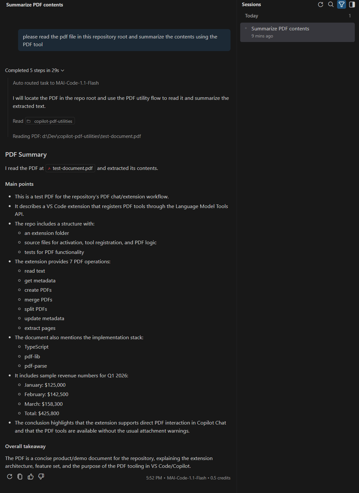
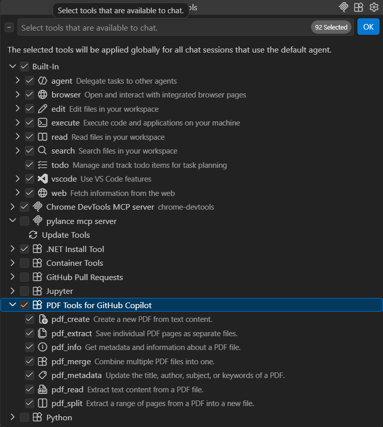

# PDF Utilities for GitHub Copilot



AI-powered PDF tools built directly into GitHub Copilot agent mode — no MCP server, no subprocess, works everywhere.

## Why this extension exists

Model Context Protocol (MCP) servers are the usual way to give Copilot new tools — but in most organizations, MCP is blocked outright. It typically means allowing arbitrary local processes or external network endpoints into the chat context, which security teams routinely disallow via policy (`chat.mcp.enabled` locked to `false` by admin, or MCP disabled organization-wide in GitHub Copilot Business/Enterprise settings). If you've ever had an MCP server rejected by IT, this is why.

This extension sidesteps that entirely. It registers its tools through VS Code's native **Language Model Tools API** (`vscode.lm.registerTool`) — the same mechanism VS Code itself uses for built-in tools. There's no server to run, no port to open, and no separate process to whitelist. From your organization's point of view it's just a VS Code extension, subject to the same install policy as any other extension — not a new class of thing that needs a security exception. Everything runs in-process, using [pdf-lib](https://pdf-lib.js.org/) and [pdf-parse](https://www.npmjs.com/package/pdf-parse) directly, with no data leaving your machine.

If MCP is available to you, this still works — it's just not required.

## Features



* **Read PDFs** — Extract text content (full file or specific page ranges), with word count, approximate LLM token count, and optional `maxWords`/`maxTokens` pagination
* **Get PDF Info** — Retrieve metadata: page count, title, author, file size, dates, word count, token estimate
* **Create PDFs** — Generate a new PDF from plain text with custom formatting
* **Merge PDFs** — Combine multiple PDF files into one
* **Split PDFs** — Extract a page range to a new file
* **Update Metadata** — Modify title, author, subject, keywords
* **Extract Pages** — Save individual pages as separate PDF files

All 7 tools are available in Copilot agent mode and can be referenced with `#`.

## What's new in 2.1.0

* `read_pdf` and `get_pdf_info` now return `wordCount` and `approxTokenCount` (a `ceil(chars/4)` estimate, ~±10% accurate for English, comparable across GPT/Claude BPE tokenizers).
* `read_pdf` accepts optional `maxWords` or `maxTokens` parameters to paginate large PDFs — text is truncated at a word boundary, while the full document's word/token counts are always reported so Copilot knows how much more there is to read.
* Useful for large PDFs: ask Copilot to check `get_pdf_info` first to see the token estimate, then pull the document in chunks with `maxTokens` instead of dumping the whole thing into context at once.

See [CHANGELOG.md](CHANGELOG.md) for full details.

## Installation

1. Open VS Code
2. Go to Extensions (`Ctrl+Shift+X`)
3. Search for **PDF Utilities**
4. Click **Install**

Requirements: VS Code 1.100+ and GitHub Copilot.

### From a VSIX file

1. Download the `.vsix` from [Releases](https://github.com/thekaasking/copilot-pdf-utilities/releases) (or build one with `npm run package`)
2. Command Palette (`Ctrl+Shift+P`) → **Extensions: Install from VSIX...**
3. Select the downloaded file

## Usage

### Agent mode (recommended)

Ask Copilot in agent mode — tools are invoked automatically:

```
Read /home/user/report.pdf and summarise it
Get info on /tmp/big-report.pdf before reading it — how many tokens is it?
Read the first 2000 tokens of /tmp/big-report.pdf
Create a PDF at /tmp/notes.pdf from the following text: ...
Merge /tmp/a.pdf and /tmp/b.pdf into /tmp/combined.pdf
Extract pages 1-5 from /tmp/long.pdf and save to /tmp/short.pdf
```

### Manual tool references

You can reference tools explicitly with `#`:

```
#pdf_read  #pdf_info  #pdf_create  #pdf_merge
#pdf_split  #pdf_metadata  #pdf_extract
```

### @pdf Chat Participant

Attach a PDF file in chat and ask questions about it:

1. Click the **📎 attach** button
2. Select a PDF file
3. Type `@pdf What does this document say?`

## Manually testing the 2.1.0 features

With the extension installed and GitHub Copilot Chat open in **agent mode**:

1. **Word/token counts on `get_pdf_info`** — attach or reference a PDF and ask:

   ```
   #pdf_info Get info on <absolute path to a .pdf>
   ```

   The JSON result should include `wordCount` and `approxTokenCount` alongside the existing metadata fields.

2. **Word/token counts on `read_pdf`** — ask:

   ```
   #pdf_read Read <absolute path to a .pdf>
   ```

   The result includes top-level `wordCount` and `approxTokenCount` for the full document (also mirrored inside `info`).

3. **`maxWords` pagination** — ask:

   ```
   Read the first 50 words of <absolute path to a .pdf>
   ```

   Copilot should call `read_pdf` with `maxWords: 50`. The returned `text` is truncated at a word boundary, `truncated: true` and `truncationMethod: "maxWords"` are set, while `wordCount`/`approxTokenCount` still reflect the *full* document.

4. **`maxTokens` pagination** — ask:

   ```
   Read about 500 tokens worth of <absolute path to a .pdf>
   ```

   Same as above, but with `truncationMethod: "maxTokens"`.

5. **No truncation on a short document** — read a short PDF with no `maxWords`/`maxTokens`; confirm `truncated` is absent from the response entirely (rather than `false`).

A sample PDF is included in this repo for convenience: `test-document.pdf`.

## Available Tools

| Reference | Tool Name | Description |
| --- | --- | --- |
| `#pdf_read` | Read PDF | Extract text, optionally with page range and maxWords/maxTokens pagination |
| `#pdf_info` | Get PDF Info | Metadata (pages, title, author, size, word count, token estimate) |
| `#pdf_create` | Create PDF | New PDF from text content |
| `#pdf_merge` | Merge PDFs | Combine multiple PDFs into one |
| `#pdf_split` | Split PDF | Extract page range to new file |
| `#pdf_metadata` | Update Metadata | Set title, author, subject, keywords |
| `#pdf_extract` | Extract Pages | Save individual pages as files |

> Note: File paths must be **absolute** (e.g. `C:\Users\me\file.pdf` or `/home/me/file.pdf`).

## Configuration

`Ctrl+,` → search for **PDF Utilities**

| Setting | Default | Description |
| --- | --- | --- |
| `pdfUtilities.logLevel` | `info` | Log verbosity: error / warn / info / debug |
| `pdfUtilities.maxPdfSize` | `50` | Maximum PDF file size in MB |

## Commands

Open the Command Palette (`Ctrl+Shift+P`) and type **PDF Utilities**:

* **PDF Utilities: Show Available PDF Tools** — list tool reference names
* **PDF Utilities: Open PDF Utilities Documentation** — open online docs

## Troubleshooting

**Tools not appearing in agent mode**

* Confirm the extension is enabled in the Extensions panel.
* Check the Output panel (`View › Output › PDF Utilities`) for activation messages.
* Reload VS Code if tools appeared previously but are now missing.

**"File not found" errors**

* Use absolute paths (not relative paths like `./file.pdf`).
* Verify the file exists and you have read permission.

**"Invalid page number" errors**

* Pages are 1-based. First page = `1`.
* Range format: `1-5` or `1,3,5-10`.

**Large PDFs are slow**

* Increase `pdfUtilities.maxPdfSize` if needed.
* Use `maxWords`/`maxTokens` on `read_pdf` to pull the document in chunks instead of all at once.
* Consider splitting or extracting only the pages you need.

## License

MIT — see [LICENSE](LICENSE)

## Links

* [GitHub Repository](https://github.com/thekaasking/copilot-pdf-utilities)
* [Report Issues](https://github.com/thekaasking/copilot-pdf-utilities/issues)
* [pdf-lib](https://pdf-lib.js.org/) · [pdf-parse](https://www.npmjs.com/package/pdf-parse)
